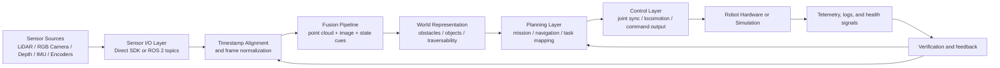
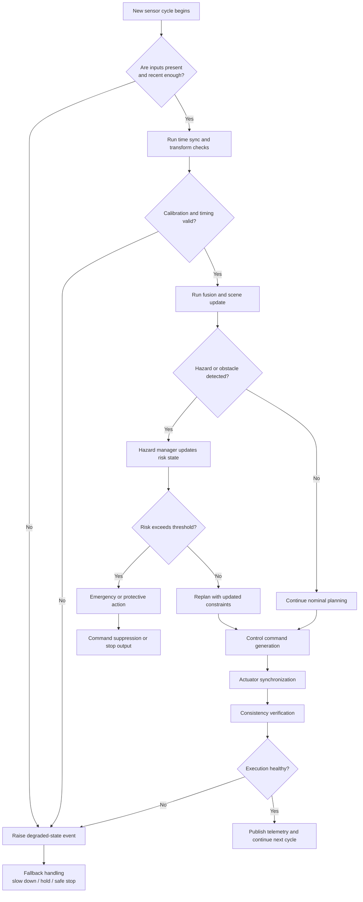

# Robot LiDAR Fusion

[](LICENSE)
[](https://www.python.org/downloads/)
[](https://pypi.org/project/robot-lidar-fusion/)
[](https://pypi.org/project/robot-lidar-fusion/)
[](https://github.com/iceccarelli/robot-lidar-fusion/pkgs/container/robot-lidar-fusion)
[](https://github.com/iceccarelli/robot-lidar-fusion/actions/workflows/ci.yml)
[](https://docs.ros.org/)
[](https://github.com/astral-sh/ruff)

**Robot LiDAR Fusion** is an open-source robotics software stack for teams working on **LiDAR-camera perception**, **ROS 2-native robotics workflows**, and **release-ready autonomy software**.

The aim of this repository is simple: to offer a serious, readable, and reproducible foundation for robotics work. We are not trying to claim that every subsystem is already complete. Instead, we are trying to build the repository in a way that is honest, useful, and easy to trust. If something is present, it should be understandable. If something is promised, it should be measurable. If something is released, it should be tested, packaged, documented, and reproducible.

This project is still growing!

| Focus area | What this repository is trying to do well |
|---|---|
| Perception | Build a practical LiDAR-camera fusion baseline that can mature into a real robotics perception stack |
| ROS 2 integration | Keep ROS 2 as the native execution path while allowing graceful non-ROS development workflows |
| Release discipline | Align source code, package metadata, tags, containers, and documentation |
| Adoption | Make the repository easier for engineers, researchers, and contributors to run, inspect, and extend |

## Why this repository exists

A lot of robotics repositories are either impressive but difficult to reproduce, or tidy on the surface but too thin to be useful in real work. Teams often end up rebuilding the same integration layers: sensor ingestion, timestamp alignment, calibration handling, state verification, safety checks, planning hooks, and deployment scripts. That repeated integration work is expensive, and it is often where projects become fragile.

**Robot LiDAR Fusion** is an attempt to reduce that friction. The goal is to provide a foundation that helps bridge the gap between raw sensor streams and autonomy-ready decision making, without pretending that robotics becomes easy. We want the repository to be honest about what is already solid, clear about what is still in progress, and welcoming to the kind of contributions that improve real capability rather than just surface polish.

| Design principle | What it means in practice |
|---|---|
| Reproducibility first | Build, test, package, and release behavior should be repeatable |
| Humility over hype | The README should tell the truth about current maturity |
| Robotics value over cosmetics | Perception, planning, and validation come before decorative features |
| ROS 2-native, not ROS 2-only | ROS 2 is the intended robotics path, but local developer ergonomics still matter |

## What the repository currently offers

The current state of the repository is strongest in **project discipline** and **architecture scaffolding**. Packaging, CI, security scanning, and core module organization are in place. The repository already contains a meaningful breakdown of perception, planning, control, safety, and power-related modules, even though some of the deeper robotics algorithms are still on the roadmap rather than fully realized.

This is important because good robotics software is not only about algorithms. It is also about whether another engineer can install the project, inspect the structure, understand the assumptions, run the checks, and reproduce the results. That is the standard this project is trying to reach.

| Capability | Current state |
|---|---|
| Python packaging | Present and release-oriented |
| CI checks | Present |
| Ruff, Black, tests, security scanning | Present |
| ROS 2 integration path | Present as an optional path |
| Direct sensor ingestion path | Present |
| Real calibration-aware LiDAR-camera fusion | In progress |
| Mapping and navigation stack | Planned next-stage work |
| Simulation, benchmarks, telemetry | Planned next-stage work |

## System architecture

At a high level, the repository is organized around a simple but important robotics chain: **ingest**, **synchronize**, **fuse**, **understand**, **plan**, **act**, and **verify**. The objective is not just to move data from one module to another, but to keep the reactions between those modules explicit and inspectable.



The diagram above describes the **main operational flow**. Sensor data is brought in through ROS 2 or direct interfaces, aligned in time and space, fused into a more useful scene estimate, then handed to planning and control. Verification is not a separate afterthought. It feeds back into perception and planning so that the robot does not continue blindly when the underlying assumptions degrade.

| Layer | Core responsibility |
|---|---|
| Sensor I/O | Acquire frames and point clouds from ROS 2 or direct drivers |
| Time and frame handling | Align timestamps and normalize reference frames |
| Fusion | Combine heterogeneous sensor observations into one usable estimate |
| Planning | Turn perception output into navigation and task decisions |
| Control | Convert decisions into bounded robot commands |
| Verification | Detect hazards, stale data, and inconsistent execution |

## Chain of reactions and safety logic

In a serious robotics system, the most important logic often lives in the reactions between subsystems. What should happen when a frame arrives late, when a transform is invalid, when a hazard becomes visible, or when the control output no longer matches the sensed state? Those reactions should be visible and deliberate.



This second diagram shows the **reaction chain**. The robot first decides whether it can trust its inputs, then whether it can trust its timing and calibration assumptions, then whether the fused scene implies new risk, and only then whether it is safe to continue producing control output. If execution becomes inconsistent, the system should degrade safely instead of hiding the problem.

| Reaction stage | Expected behavior |
|---|---|
| Missing or stale input | Mark the cycle degraded and avoid unsafe decisions |
| Invalid timing or transforms | Refuse to trust downstream fusion until assumptions are restored |
| Detected hazard | Update risk state before planning or control continues |
| Failed execution verification | Hold, stop, or enter a bounded recovery path |
| Healthy cycle | Publish telemetry and continue deterministically |

## Repository layout

The repository layout is intentionally structured to make the system easier to understand and extend. The main package lives under `robot_hw`, with separate areas for perception, planning, control, core services, and power-related logic.

```text
robot-lidar-fusion/
├── robot_hw/
│   ├── ai/
│   ├── control/
│   ├── core/
│   ├── perception/
│   ├── planning/
│   ├── power/
│   ├── robot_config.py
│   ├── robot_orchestrator.py
│   ├── simulation.py
│   └── stress_simulation.py
├── calibration/
├── config/
├── docs/
├── examples/
├── scripts/
├── tests/
├── Dockerfile
├── pyproject.toml
└── README.md
```

| Directory | Purpose |
|---|---|
| `robot_hw/perception` | Sensor I/O, time sync, sensor frames, and fusion logic |
| `robot_hw/planning` | Mission sequencing, navigation, and task-to-hardware mapping |
| `robot_hw/control` | Command generation and actuator coordination |
| `robot_hw/core` | Hazard handling, communication, consistency checks, and fault logic |
| `calibration` | Intrinsics, extrinsics, and future calibration assets |
| `scripts` and `examples` | Entry points for demos, replay, and bring-up |
| `tests` | Unit and integration coverage for key behavior |

## Installation

The project targets **Python 3.11, 3.12, and 3.13**. ROS 2 is an optional dependency path rather than a mandatory installation requirement, which makes local development easier while preserving a ROS 2-native runtime direction.

```bash
git clone https://github.com/iceccarelli/robot-lidar-fusion.git
cd robot-lidar-fusion
python -m venv .venv
source .venv/bin/activate
pip install --upgrade pip
pip install -e ".[dev]"
```

If you are working in a ROS 2-capable environment, you can install the ROS 2 extras explicitly.

```bash
pip install -e ".[dev,ros2]"
```

| Install path | Recommended use |
|---|---|
| `.[dev]` | Local development, tests, formatting, typing, and builds |
| `.[dev,ros2]` | ROS 2-enabled development environments |
| Container image | Reproducible execution and CI-aligned validation |

## Quick start

A good quick start should not try to do everything at once. It should first prove that the repository installs cleanly, that the quality gates work, and that the project can be built in a repeatable way.

```bash
# install dependencies
pip install -e ".[dev]"

# run tests
pytest -v

# run lint and formatting checks
ruff check .
black --check .

# build release artifacts
python -m build
```

Once those checks are green, you have a stable baseline from which to move toward sensor replay, ROS 2 bring-up, and real-hardware integration.

| Verification step | Why it matters |
|---|---|
| `pytest -v` | Confirms expected behavior still holds |
| `ruff check .` | Keeps the codebase clean and reviewable |
| `black --check .` | Prevents formatting drift |
| `python -m build` | Confirms the package is releasable |

## Supported workflows

The repository is being shaped around a few workflows that are genuinely useful for robotics engineering rather than artificially broad claims.

| Workflow | Intent |
|---|---|
| Local development without ROS 2 | Build, test, lint, and package the project cleanly |
| ROS 2-native execution | Use ROS 2 topics and launch flows as the main robotics path |
| Direct sensor experimentation | Run targeted tests against vendor SDKs when needed |
| Replay-driven validation | Re-run data deterministically to inspect perception behavior |
| Containerized validation | Reproduce runtime and build behavior in a clean environment |

## Development and release discipline

One of the main goals of this repository is to become a robotics project that people can trust. That trust does not come from bold claims. It comes from consistency. A proper release here means that the **source code**, **package version**, **Git tag**, **release notes**, **container image**, and **README** all point to the same state.

The same philosophy applies to feature work. A feature is not considered done just because it worked once in a local script. It should be demonstrable, tested, typed where relevant, security-scanned, packaged, containerized, and documented. That bar is intentionally high, but it is also what keeps a repository useful over time.

| Release requirement | Why it matters |
|---|---|
| Version consistency | Prevents tags, source, and published artifacts from drifting apart |
| CI enforcement | Protects releases from avoidable regressions |
| Container validation | Makes debugging and deployment more reproducible |
| Honest documentation | Helps new users understand current maturity without guesswork |

## Roadmap

The roadmap is practical and stage-based. The early work focuses on **truth in packaging** and **CI discipline**, because everything else depends on that foundation. The next stages move toward **reproducible demos**, **real calibration-aware fusion**, **mapping and navigation**, and then **simulation, benchmarking, and telemetry**.

| Stage | Focus |
|---|---|
| Stage 1 | Packaging, metadata, version truth, workflow discipline |
| Stage 2 | Integrated CI with linting, tests, security, and build validation |
| Stage 3 | Reproducible demo, launch files, replay, and RViz configuration |
| Stage 4 | Real LiDAR-camera fusion with calibration, sync, transforms, and object-level fusion |
| Stage 5 | Mapping, costmaps, planning, and Nav2-compatible workflows |
| Stage 6 | Simulation adapters, benchmarks, regression artifacts, and telemetry |

## Contributing

Contributions are welcome, especially when they improve the repository in ways that are measurable and useful. Good contributions are usually not the loudest ones. They are the ones that make the system easier to run, easier to verify, easier to understand, or harder to break.

If you want to contribute, a great place to start is by asking one simple question: **does this change make the repository more trustworthy for real robotics work?** If the answer is yes, it is probably a strong contribution.

| Useful contribution types | Why they help |
|---|---|
| Better replay or bring-up tooling | Makes demos and debugging reproducible |
| Improved fusion or calibration logic | Adds direct robotics value |
| More tests or stricter checks | Protects the codebase as it grows |
| Better documentation | Lowers the cost of onboarding and review |

## License

This project is released under the **Apache License 2.0**.

## Final note

This repository is still growing, and that is part of its value. It is being built in the open, with a deliberate effort to improve not only the algorithms but also the engineering habits around them. The hope is that over time **Robot LiDAR Fusion** becomes the kind of repository people return to because it is useful, honest, and steadily improving.
