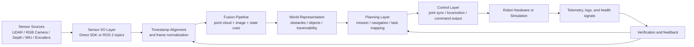
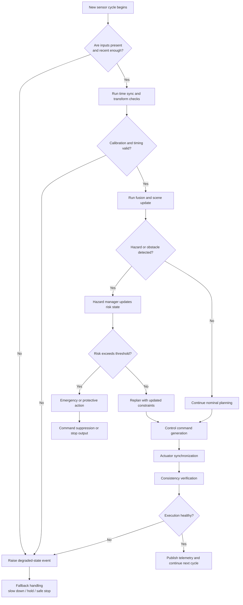

# Robot LiDAR Fusion

**Robot LiDAR Fusion** is an open-source robotics software stack for teams working on **LiDAR-camera perception**, **ROS 2-native robotics workflows**, and **release-ready autonomy software**.

[](LICENSE)
[](https://www.python.org/downloads/)
[](https://pypi.org/project/robot-lidar-fusion/)
[](https://pypi.org/project/robot-lidar-fusion/)
[](https://github.com/iceccarelli/robot-lidar-fusion/pkgs/container/robot-lidar-fusion)
[](https://github.com/iceccarelli/robot-lidar-fusion/actions/workflows/ci.yml)
[](https://docs.ros.org/)
[](https://github.com/astral-sh/ruff)

---

## Table of Contents

- [Why This Repository Exists](#why-this-repository-exists)
- [What the Repository Currently Offers](#what-the-repository-currently-offers)
- [System Architecture](#system-architecture)
- [Chain of Reactions and Safety Logic](#chain-of-reactions-and-safety-logic)
- [Repository Layout](#repository-layout)
- [Installation](#installation)
- [Quick Start](#quick-start)
- [Supported Workflows](#supported-workflows)
- [Development and Release Discipline](#development-and-release-discipline)
- [Roadmap](#roadmap)
- [Contributing](#contributing)
- [License](#license)

---

**Imagine starting a new robotics project and *not* having to rebuild the same sensor pipelines, timestamp sync logic, safety checks, and release pipelines from scratch.**  

That is the quiet promise of **Robot LiDAR Fusion**: a clean, honest, and deliberately engineered foundation that lets you move faster from raw sensor data to trustworthy autonomy — without the usual hidden fragility.

This repository was built by engineers who have felt the pain of “impressive demo” repos that fall apart the moment you try to reproduce them on real hardware. Here, every line of code, every diagram, and every claim is written with one goal in mind: **trust**.  

If you care about perception that actually works in the field, ROS 2 workflows that feel native, and a codebase you can hand to a teammate without a 30-minute explanation, keep reading. You’ll see exactly where we are today, where we’re headed, and why this foundation is worth your time.

## Why This Repository Exists

Robotics teams repeatedly waste weeks — sometimes months — rebuilding the same integration layers: sensor ingestion, timestamp alignment, calibration handling, state verification, safety checks, planning hooks, and deployment scripts. Those layers are where projects become fragile.

**Robot LiDAR Fusion** exists to reduce that friction. It provides a serious, readable, and reproducible foundation for LiDAR-camera perception and ROS 2-native autonomy — without pretending that robotics becomes easy.  

We are honest about current maturity, transparent about what is solid versus what is still maturing, and focused on contributions that add *real* robotics value rather than surface polish.

| Design Principle       | What It Means in Practice                              |
|------------------------|--------------------------------------------------------|
| Reproducibility first  | Every build, test, package, and release is repeatable |
| Humility over hype     | The documentation tells the truth about current state  |
| Robotics value first   | Perception, planning, and validation before cosmetics  |
| ROS 2-native, not only | ROS 2 is the intended path; local ergonomics still matter |

## What the Repository Currently Offers

The current strength lies in **project discipline** and **architecture scaffolding**. Packaging, CI/CD, security scanning, and modular organization are production-ready. The repository already contains a clear breakdown of perception, planning, control, safety, and power modules — even though some deeper algorithms are still maturing.

This matters because great robotics software is not only about clever algorithms. It is about whether another engineer can install it, understand the assumptions, run the checks, and reproduce the results.

| Capability                          | Current State                  |
|-------------------------------------|--------------------------------|
| Python packaging & release process  | Fully present and disciplined  |
| CI checks (lint, test, security)    | Fully present                  |
| Ruff, Black, pytest, security scan  | Enforced                       |
| ROS 2 integration path              | Optional but native            |
| Direct sensor ingestion path        | Present                        |
| Real calibration-aware LiDAR-camera fusion | In active development     |
| Mapping & navigation stack          | Planned next-stage work        |
| Simulation, benchmarks, telemetry   | Planned next-stage work        |

## System Architecture

The repository is organized around a clear robotics data chain: **ingest → synchronize → fuse → understand → plan → act → verify**. Every step keeps reactions explicit and inspectable.



The diagram shows the **main operational flow**. Sensor data enters through ROS 2 or direct drivers, is aligned in time and space, fused into a coherent scene estimate, and handed to planning and control. Verification is never an afterthought — it continuously feeds back into perception and planning so the robot never continues blindly when assumptions degrade.

| Layer                | Core Responsibility                                      |
|----------------------|----------------------------------------------------------|
| Sensor I/O           | Acquire frames and point clouds from ROS 2 or direct drivers |
| Time & frame handling| Align timestamps and normalize reference frames          |
| Fusion               | Combine heterogeneous sensor observations                |
| Planning             | Turn perception output into navigation and task decisions|
| Control              | Convert decisions into bounded robot commands            |
| Verification         | Detect hazards, stale data, and inconsistent execution   |

## Chain of Reactions and Safety Logic

In any serious robotics system, the *most important logic lives in the reactions between subsystems*. What happens when a frame arrives late, a transform is invalid, or a hazard suddenly appears?



This **reaction chain** makes safety visible and deliberate. The system first verifies trust in inputs, then timing and calibration, then scene risk — and only then produces control output. If execution becomes inconsistent, it degrades gracefully instead of hiding the problem.

| Reaction Stage             | Expected Behavior                                      |
|----------------------------|--------------------------------------------------------|
| Missing or stale input     | Mark cycle degraded and avoid unsafe decisions         |
| Invalid timing/transforms  | Refuse downstream fusion until assumptions restored    |
| Detected hazard            | Update risk state before planning/control continues    |
| Failed execution verification | Hold, stop, or enter bounded recovery path          |
| Healthy cycle              | Publish telemetry and continue deterministically       |

## Repository Layout

The structure is intentionally clear and extensible. The core package lives under `robot_hw`, with dedicated areas for each major subsystem.

```text
robot-lidar-fusion/
├── robot_hw/
│   ├── ai/
│   ├── control/
│   ├── core/
│   ├── perception/
│   ├── planning/
│   ├── power/
│   ├── robot_config.py
│   ├── robot_orchestrator.py
│   ├── simulation.py
│   └── stress_simulation.py
├── calibration/
├── config/
├── docs/
├── examples/
├── scripts/
├── tests/
├── .github/workflows/     # CI/CD pipelines
├── enterprise/            # Enterprise-ready extensions
├── gateway/               # External interface layer
├── .env.example
├── CHANGELOG.md
├── CODE_OF_CONDUCT.md
├── CONTRIBUTING.md
├── Dockerfile
├── docker-compose.yml
├── Makefile
├── pyproject.toml
└── README.md
```

| Directory                  | Purpose |
|----------------------------|---------|
| `robot_hw/perception`      | Sensor I/O, time sync, fusion logic |
| `robot_hw/planning`        | Mission sequencing, navigation, task mapping |
| `robot_hw/control`         | Command generation and actuator coordination |
| `robot_hw/core`            | Hazard handling, communication, consistency checks |
| `calibration/`             | Intrinsics, extrinsics, and calibration assets |
| `scripts/` & `examples/`   | Entry points, demos, replay, and bring-up |
| `tests/`                   | Unit and integration coverage |
| `docker-compose.yml`       | Multi-container orchestration |
| `Makefile`                 | Build automation and common tasks |

## Installation

The project supports **Python 3.11, 3.12, and 3.13**. ROS 2 is optional — making local development frictionless while preserving a true ROS 2-native runtime.

```bash
git clone https://github.com/iceccarelli/robot-lidar-fusion.git
cd robot-lidar-fusion
python -m venv .venv
source .venv/bin/activate
pip install --upgrade pip
pip install -e ".[dev]"
```

For ROS 2 environments:

```bash
pip install -e ".[dev,ros2]"
```

Containerized execution (recommended for reproducibility):

```bash
docker compose up --build
```

## Quick Start

Prove the foundation is solid before diving deeper:

```bash
# Install in development mode
pip install -e ".[dev]"

# Run the full quality suite
make test          # or: pytest -v
make lint          # ruff + black checks
make build         # package artifacts

# Container validation
make docker-build
```

| Verification Step       | Why It Matters |
|-------------------------|----------------|
| `make test`             | Confirms behavior still holds |
| `make lint`             | Keeps code clean and reviewable |
| `make build`            | Confirms the package is releasable |
| `make docker-build`     | Validates container reproducibility |

## Supported Workflows

| Workflow                        | Intent |
|---------------------------------|--------|
| Local development (no ROS 2)    | Build, test, lint, and package cleanly |
| ROS 2-native execution          | Use topics and launch files as primary path |
| Direct sensor experimentation   | Target vendor SDKs when needed |
| Replay-driven validation        | Deterministic inspection of perception |
| Containerized validation        | Reproduce runtime in clean environments |

## Development and Release Discipline

Trust comes from consistency. A release here means the **source code**, **package version**, **Git tag**, **release notes**, **container image**, and **documentation** all describe the exact same state.

| Release Requirement      | Why It Matters |
|--------------------------|----------------|
| Version & tag alignment  | Prevents drift between artifacts |
| CI enforcement           | Protects against regressions |
| Container validation     | Makes debugging and deployment reproducible |
| Honest documentation     | Sets correct expectations for users |

## Roadmap

We move forward in deliberate, measurable stages.

| Stage | Focus |
|-------|-------|
| Stage 1 | Packaging, metadata, version truth, workflow discipline |
| Stage 2 | Integrated CI with linting, tests, security, and build validation |
| Stage 3 | Reproducible demos, launch files, replay, and RViz configuration |
| Stage 4 | Real LiDAR-camera fusion with calibration, sync, transforms, and object-level fusion |
| Stage 5 | Mapping, costmaps, planning, and Nav2-compatible workflows |
| Stage 6 | Simulation adapters, benchmarks, regression artifacts, and telemetry |

## Contributing

Contributions are genuinely welcome — especially those that make the system more trustworthy for real robotics work.  

The best contributions are usually quiet but powerful: better replay tooling, improved fusion logic, stricter tests, or clearer documentation.  

Start by asking yourself one question: **Does this change make the repository more useful for real robotics work?** If the answer is yes, you are in the right place.

See [CONTRIBUTING.md](CONTRIBUTING.md) and [CODE_OF_CONDUCT.md](CODE_OF_CONDUCT.md) for details.

## License

This project is released under the **Apache License 2.0**.

---

**This repository is still growing — and that is part of its value.**  
It is being built in the open, with deliberate focus on both the algorithms *and* the engineering habits around them.  

The hope is that **Robot LiDAR Fusion** becomes the kind of repository engineers return to because it is useful, honest, steadily improving, and — most importantly — trustworthy.

Welcome aboard. Let’s build something solid.
