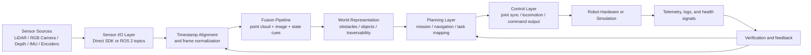
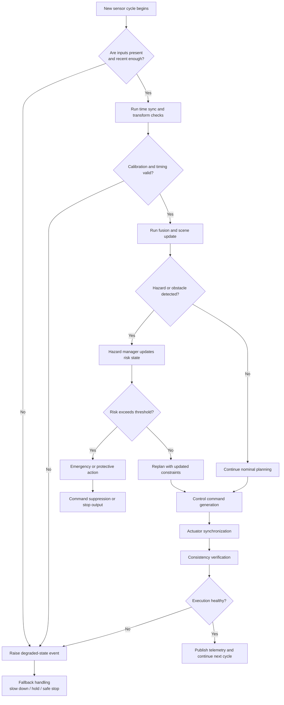

# Robot LiDAR Fusion

**Robot LiDAR Fusion** is an open-source robotics software stack for teams that need a reproducible path from raw sensors to actionable autonomy. It is designed for **LiDAR-camera perception**, **ROS 2-native integration**, **navigation readiness**, and **safety-aware control**, while still remaining usable on machines that do not have ROS 2 installed.

This repository is not trying to be a flashy demo. It is meant to become a reliable foundation for real robotics work: ingest sensors, align time, fuse observations, build scene understanding, hand that understanding to planning and control, and do all of it with testing, packaging, containerization, and release discipline.

The project is being developed in stages. Today, the strongest guarantees are around **packaging**, **CI**, **code quality**, and the basic perception/control scaffolding. The roadmap then moves toward **reproducible demos**, **real sensor fusion**, **mapping and navigation**, and finally **simulation, benchmarking, and telemetry**.

| Area | Current intent |
|---|---|
| Perception | Build a trustworthy LiDAR-camera fusion pipeline with ROS 2 as the native runtime path |
| Controls | Keep actuator and orchestration interfaces deterministic and testable |
| Releases | Enforce versioned, typed, scanned, packaged, and containerized delivery |
| Adoption | Make it easy for researchers and engineers to run, inspect, extend, and benchmark |

## Why this project exists

Most robotics repositories solve one narrow problem well, but leave the integrator to connect everything else by hand. In practice, that means one code path for raw sensor drivers, another for frame alignment, another for fusion, another for planning, and a final collection of brittle scripts for deployment. The result is usually impressive in a lab notebook and fragile in a real workflow.

**Robot LiDAR Fusion** exists to close that gap. The goal is to provide a single engineering baseline where perception, planning, safety, validation, and publication discipline all move together. If a feature cannot be demonstrated, tested, typed, scanned, packaged, containerized, and documented, it is not finished.

| Design principle | What it means here |
|---|---|
| Reproducibility first | Demos and releases must be repeatable across environments |
| Robotics value over cosmetics | Real perception and planning features come before surface polish |
| ROS 2-native, not ROS 2-only | ROS 2 should be the main path, but local fallbacks should fail gracefully |
| Release discipline | Versions, tags, builds, containers, and docs must stay aligned |

## System architecture

At a high level, the repository is organized around a deterministic chain: **ingest**, **synchronize**, **fuse**, **decide**, **act**, and **verify**. The orchestrator is the spine of the system, but the real value comes from how the perception, planning, control, and safety layers exchange state without collapsing into ad hoc glue code.



The first diagram shows the **main autonomy path**. Data enters through direct sensor SDKs or ROS 2 topics, is normalized and synchronized, then becomes a fused scene representation that planning and control can actually use. Just as importantly, telemetry and verification flow back into both perception and planning so the robot is not blindly executing stale assumptions.

| Layer | Core responsibility |
|---|---|
| Sensor I/O | Acquire frames and point clouds from ROS 2 or direct interfaces |
| Time and frame handling | Align timestamps and normalize spatial references |
| Fusion | Combine heterogeneous observations into one usable scene estimate |
| Planning | Turn scene understanding into tasks, routes, and motion intent |
| Control | Convert intent into bounded robot commands |
| Verification | Detect inconsistencies, hazards, faults, and degraded states |

## Chain of reactions and safety logic

In robotics, the interesting part is rarely the happy path alone. The critical engineering question is what happens when the chain reacts to new evidence: a closer obstacle, stale timestamps, a hot actuator, a dropped frame, or a control inconsistency. The system therefore needs a visible reaction model rather than hidden conditional logic.



This second diagram describes the **reaction chain** that makes the platform useful in practice. The robot does not simply process data and move. It first checks that the inputs are fresh, then validates timing and calibration assumptions, then updates the scene, then asks whether the scene implies new risk, and only then produces control. If execution becomes inconsistent at any point, the system should degrade safely rather than silently continue.

| Reaction stage | Expected behavior |
|---|---|
| Missing or stale input | Mark the cycle degraded and avoid unsafe control decisions |
| Invalid timing or transform state | Refuse to trust fusion output until assumptions are restored |
| New hazard detected | Update risk state before navigation or control proceeds |
| Control inconsistency | Stop, hold, or re-enter a bounded recovery path |
| Healthy cycle | Publish telemetry and continue deterministically |

## What the repository currently offers

The repository already provides the structural pieces needed for a serious robotics foundation. The Python package metadata is in place, the CI path runs formatting, linting, security checks, and tests, and the codebase has been moving toward release-readiness with reproducible build behavior. That matters because perception stacks become much easier to trust when they can be built and validated the same way every time.

At the subsystem level, the project already contains modules for **sensor ingestion**, **time synchronization**, **sensor processing**, **mission planning**, **navigation management**, **hardware synchronization**, **hazard handling**, **fault detection**, and **power-aware management**. Some of these pieces are still scaffolding rather than fully mature robotics algorithms, but the repository structure already reflects the intended production flow.

| Capability | Status |
|---|---|
| Python packaging | Present and release-oriented |
| CI quality gates | Present |
| ROS 2 integration path | Present as optional dependency path |
| Direct sensor ingestion path | Present |
| Real projective LiDAR-camera fusion | In progress / target stage |
| Mapping and navigation integration | Planned expansion |
| Benchmarks and simulation adapters | Planned expansion |

## Repository layout

The project layout is intentionally explicit so that perception, planning, and infrastructure work can evolve without becoming tangled. The main package lives under `robot_hw`, and its structure already hints at the intended separation between real-time robotics concerns.

```text
robot-lidar-fusion/
├── robot_hw/
│   ├── ai/
│   ├── control/
│   ├── core/
│   ├── perception/
│   ├── planning/
│   ├── power/
│   ├── robot_config.py
│   ├── robot_orchestrator.py
│   ├── simulation.py
│   └── stress_simulation.py
├── calibration/
├── config/
├── docs/
├── examples/
├── scripts/
├── tests/
├── Dockerfile
├── pyproject.toml
└── README.md
```

| Directory | Purpose |
|---|---|
| `robot_hw/perception` | Sensor I/O, time sync, frames, and fusion logic |
| `robot_hw/planning` | Mission sequencing, navigation, and task mapping |
| `robot_hw/control` | Command generation and actuator coordination |
| `robot_hw/core` | Safety, communication, fault handling, and consistency checks |
| `calibration` | Sensor intrinsics, extrinsics, and future alignment assets |
| `scripts` and `examples` | Entry points for demos, replay, and bring-up |
| `tests` | Unit and integration coverage for core behavior |

## Installation

The project targets **Python 3.11, 3.12, and 3.13**. ROS 2 support is optional, which makes it possible to install the package in non-ROS development environments while still keeping ROS 2 as the native runtime path for full robotics deployments.

```bash
git clone https://github.com/iceccarelli/robot-lidar-fusion.git
cd robot-lidar-fusion
python -m venv .venv
source .venv/bin/activate
pip install --upgrade pip
pip install -e ".[dev]"
```

If you want ROS 2-related extras, install them explicitly where your environment supports them.

```bash
pip install -e ".[dev,ros2]"
```

| Install path | Use case |
|---|---|
| `.[dev]` | Local development, tests, formatting, typing, and packaging |
| `.[dev,ros2]` | ROS 2-enabled development environments |
| Docker image | Reproducible execution path for CI and deployment |

## Quick start

A good quick start should help you verify that the repository is alive before you attempt real hardware integration. The first goal is therefore to confirm that the package installs, the tests pass, and the basic orchestration path can be invoked in a reproducible way.

```bash
# install dependencies
pip install -e ".[dev]"

# run tests
pytest -v

# lint and format checks
ruff check .
black --check .

# build distribution artifacts
python -m build
```

Once the reproducibility baseline is green, you can move toward demos and ROS 2 bring-up as those stages mature.

| First verification step | Why it matters |
|---|---|
| `pytest -v` | Confirms the code still behaves as expected |
| `ruff check .` | Keeps the codebase clean and reviewable |
| `black --check .` | Prevents formatting drift across contributors |
| `python -m build` | Confirms the project can be packaged and released |

## Supported workflows

The project is being shaped around a small number of workflows that are genuinely useful in robotics engineering. Instead of claiming universal readiness, it is better to be precise about what the repository is trying to support and how that support matures over time.

| Workflow | Intent |
|---|---|
| Local development without ROS 2 | Build, test, lint, and package the core project cleanly |
| ROS 2-native execution | Use ROS 2 topics and launch flows as the main robotics path |
| Direct sensor experimentation | Connect vendor SDKs for targeted local experiments |
| Replay-driven validation | Re-run recorded data to inspect perception behavior deterministically |
| Containerized validation | Reproduce build and runtime behavior in a clean environment |

## Development and release discipline

This repository takes release discipline seriously because robotics code becomes expensive when the published artifacts do not match the code users believe they are running. A proper release here means more than tagging a commit. It means that the **package version**, **Git tag**, **release notes**, **container build**, and **documentation** all agree with one another.

The same rule applies to features. A new capability is not considered complete just because a script runs once on a developer machine. It should be demonstrated, tested, typed where relevant, security-scanned, packaged, containerized, and documented. That is the threshold for adding real value instead of accumulating fragile code.

| Release requirement | Why it exists |
|---|---|
| Version consistency | Prevents PyPI, tags, and source state from drifting apart |
| CI enforcement | Stops broken or partial work from becoming a release |
| Docker validation | Ensures reproducible environments for deployment and debugging |
| Documentation | Lets others understand the system without reverse engineering it |

## Roadmap

The roadmap is intentionally practical. The first stages focus on **truth in packaging and CI**, because nothing else is trustworthy until builds and releases are dependable. After that, the emphasis shifts toward **reproducible demos**, **real projective sensor fusion**, **mapping and navigation**, and finally **simulation, benchmarks, and telemetry**.

| Stage | Focus |
|---|---|
| Stage 1 | Packaging, metadata, version truth, workflow discipline |
| Stage 2 | Integrated CI with linting, tests, security, build checks |
| Stage 3 | Reproducible demo, launch files, replay, RViz configuration |
| Stage 4 | Real LiDAR-camera fusion with calibration, sync, and object-level fusion |
| Stage 5 | Mapping, costmaps, planning, and Nav2-compatible flows |
| Stage 6 | Simulation adapters, benchmarks, regression artifacts, telemetry |

## Contributing

Contributions are welcome, especially when they improve measurable robotics value. The most helpful pull requests are the ones that make the system easier to trust: a better test, a cleaner release workflow, a reproducible launch path, a stronger fusion primitive, or clearer operational documentation.

If you want to contribute, start by reading the existing structure and asking a simple question: does this change make the robot easier to run, verify, or extend? If the answer is yes, it is likely aligned with the direction of the project.

| Good contribution examples | Why they matter |
|---|---|
| Better replay or launch tooling | Makes demos and debugging reproducible |
| Improved fusion logic | Increases real robotics value |
| Additional tests | Protects future refactors and releases |
| Documentation corrections | Reduces onboarding cost for new contributors |

## License

This project is released under the **Apache License 2.0**. That choice is meant to keep the code open, usable, and friendly to both research and industrial experimentation.

## Closing note

This project is trying to take the opposite path. The aim is to build a stack that grows in public, tells the truth about its current maturity, and earns trust by being reproducible. If you are building a robot and need a foundation for LiDAR-camera perception, ROS 2 integration, safety-aware orchestration, and disciplined releases, this repository is meant to become a useful place to start.
